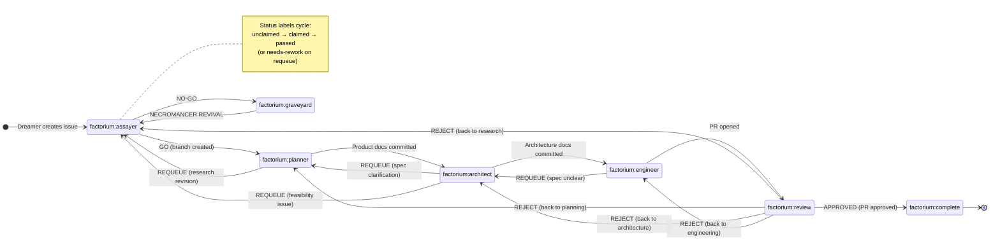
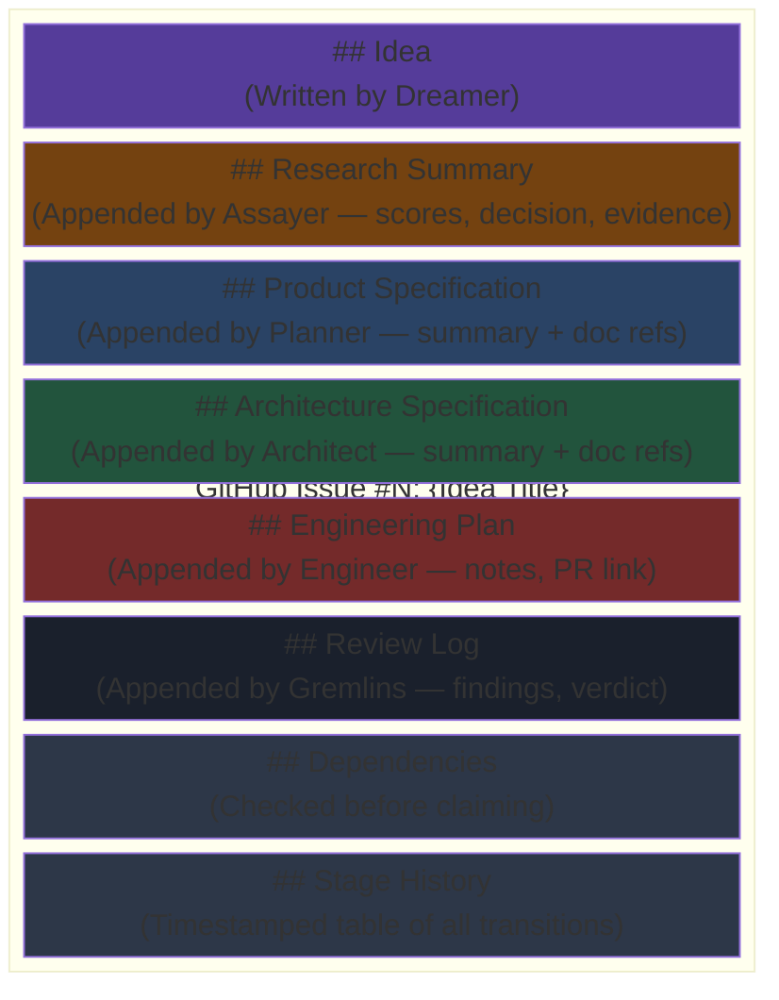
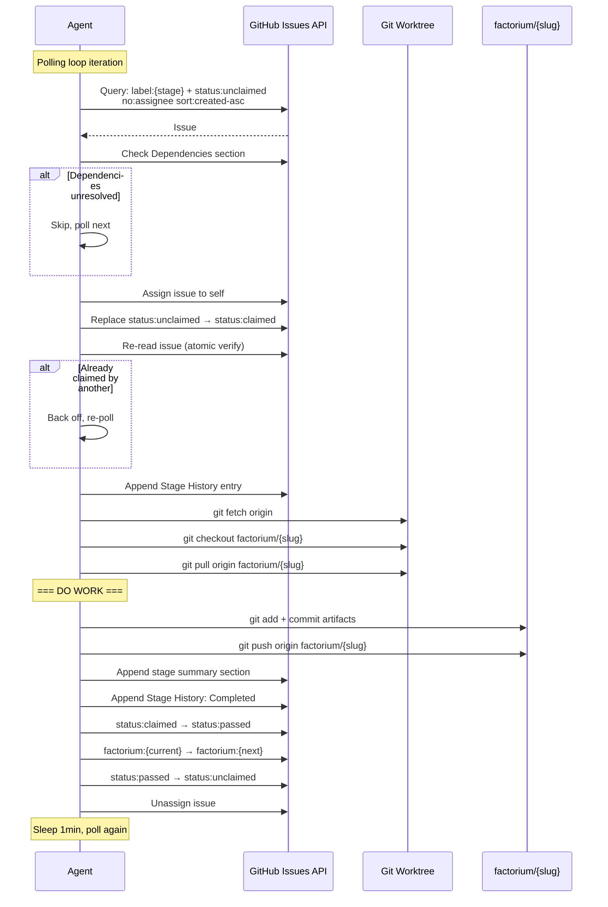

# Factorium Pipeline

```mermaid
flowchart TD
    classDef stage fill:#2d3748,stroke:#4a5568,color:#e2e8f0,stroke-width:2px
    classDef decision fill:#744210,stroke:#d69e2e,color:#fefcbf,stroke-width:2px
    classDef artifact fill:#1a365d,stroke:#3182ce,color:#bee3f8,stroke-width:1px
    classDef github fill:#22543d,stroke:#48bb78,color:#c6f6d5,stroke-width:1px
    classDef worktree fill:#553c9a,stroke:#9f7aea,color:#e9d8fd,stroke-width:1px
    classDef reject fill:#742a2a,stroke:#fc8181,color:#fed7d7,stroke-width:1px
    classDef necro fill:#1a202c,stroke:#718096,color:#cbd5e0,stroke-width:2px,stroke-dasharray:5 5

    %% ═══════════════════════════════════════════
    %% STAGE 1: DREAMER
    %% ═══════════════════════════════════════════
    DREAMER["🌙 THE DREAMER IN DARKNESS\n(Manual invocation · reads from main)"]:::stage
    DREAMER_READ["Reads: roadmap, graveyard,\nexisting ideas, project docs"]:::artifact
    DREAMER_OUT["Creates 1-6 GitHub Issues\nLabel: factorium:assayer + status:unclaimed\n(skips factorium:dreamer label)"]:::github

    DREAMER --> DREAMER_READ --> DREAMER_OUT

    %% ═══════════════════════════════════════════
    %% STAGE 2: ASSAYER
    %% ═══════════════════════════════════════════
    DREAMER_OUT --> ASSAYER_CLAIM

    subgraph ASSAYER_SUB ["⚖️ THE ASSAYER'S GUILD (Polling loop · 1min idle sleep)"]
        direction TB
        ASSAYER_CLAIM["CLAIM PROTOCOL\nQuery: factorium:assayer + status:unclaimed\nAssign → status:claimed\nVerify assignment (atomic)"]:::github

        ASSAYER_PARALLEL["PARALLEL RESEARCH\n4 Agents: Market Scout, Feasibility Assessor,\nValue Appraiser, Cost Estimator"]:::stage

        ASSAYER_RUBRIC["6-DIMENSION RUBRIC\nUser Value · Strategic Fit · Market Differentiation\nTechnical Feasibility · Effort-to-Impact · Risk\n(each scored 1-5)"]:::artifact

        ASSAYER_ADVERSARY["ASSAYER GENERAL (Adversary)\nIndependent evaluation\nCan veto even if rubric passes"]:::stage

        ASSAYER_CLAIM --> ASSAYER_PARALLEL --> ASSAYER_RUBRIC --> ASSAYER_ADVERSARY
    end

    ASSAYER_ADVERSARY --> ASSAYER_DECISION

    ASSAYER_DECISION{"GO / NO-GO\nGo: avg ≥ 3.5, no 1s, Adversary approves\nConditional: avg ≥ 3.0, 2s present\nNo-Go: avg < 3.0 OR any 1 OR veto"}:::decision

    %% Assayer outcomes
    ASSAYER_DECISION -- "NO-GO" --> GRAVEYARD["factorium:graveyard + status:passed\n(+necromancy-candidate if warranted)"]:::reject
    ASSAYER_DECISION -- "REQUEUE" --> ASSAYER_REQUEUE["status:needs-rework\nComment with feedback\nRe-enters Assayer queue"]:::reject

    ASSAYER_DECISION -- "GO / CONDITIONAL GO" --> ASSAYER_ADVANCE

    ASSAYER_ADVANCE["CREATE BRANCH\ngit branch factorium/{idea-slug} from main\nAppend Research Summary to issue\nLabel → factorium:planner + status:unclaimed"]:::worktree

    %% ═══════════════════════════════════════════
    %% STAGE 3: PLANNER
    %% ═══════════════════════════════════════════
    ASSAYER_ADVANCE --> PLANNER_CLAIM

    subgraph PLANNER_SUB ["📋 THE PLANNERS' HALL (Polling loop)"]
        direction TB
        PLANNER_CLAIM["CLAIM + CHECKOUT\nClaim issue · status:claimed\ngit checkout factorium/{idea-slug}\ngit pull"]:::github

        PLANNER_SEQ["Requirements Architect\n→ produces requirements\n→ Story Weaver (depends on reqs)\n→ writes user stories"]:::stage

        PLANNER_PAR["PARALLEL\nMetrics Smith → success metrics\nEdge Case Hunter → boundary conditions"]:::stage

        PLANNER_SKEPTIC["SKEPTIC OF SCOPE (Adversary)\nChecks: ambiguity, scope creep,\nuntraced requirements\nIron Law 02: halt on ambiguity"]:::stage

        PLANNER_CLAIM --> PLANNER_SEQ --> PLANNER_PAR --> PLANNER_SKEPTIC
    end

    PLANNER_SKEPTIC --> PLANNER_DECISION{"SCOPE\nCLEAR?"}:::decision
    PLANNER_DECISION -- "REQUEUE\nto Assayer" --> PLANNER_REQUEUE["factorium:assayer + status:needs-rework\nCommit WIP to branch\nComment: research needs revision"]:::reject

    PLANNER_DECISION -- "ADVANCE" --> PLANNER_ADVANCE

    PLANNER_ADVANCE["COMMIT TO BRANCH\n4 docs → docs/factorium/{slug}/\n· product-requirements.md\n· product-stories.md\n· product-metrics.md\n· product-edge-cases.md\nAppend Product Spec section to issue\nLabel → factorium:architect + status:unclaimed"]:::worktree

    %% ═══════════════════════════════════════════
    %% STAGE 4: ARCHITECT
    %% ═══════════════════════════════════════════
    PLANNER_ADVANCE --> ARCHITECT_CLAIM

    subgraph ARCHITECT_SUB ["🏛️ THE ARCHITECT'S LODGE (Polling loop)"]
        direction TB
        ARCHITECT_CLAIM["CLAIM + CHECKOUT\nClaim issue · status:claimed\ngit checkout factorium/{idea-slug}\ngit pull"]:::github

        ARCHITECT_PAR["PARALLEL DESIGN\nSystem Designer → component diagrams\nSchema Artisan → data models, migrations\nContract Keeper → API contracts\nSecurity Warden → threat model"]:::stage

        ARCHITECT_SHARD["SHARD MASTER\nDecomposes into parallelizable\nwork units with inter-unit contracts"]:::stage

        ARCHITECT_ADVERSARY["STRESS TESTER (Adversary)\nTraceability to product requirements\nFlags decisions requiring human approval\nIron Law 16: human is the architect"]:::stage

        ARCHITECT_CLAIM --> ARCHITECT_PAR --> ARCHITECT_SHARD --> ARCHITECT_ADVERSARY
    end

    ARCHITECT_ADVERSARY --> ARCHITECT_DECISION{"DESIGN\nSOUND?"}:::decision

    ARCHITECT_DECISION -- "REQUEUE\nto Planner" --> ARCH_REQ_PLAN["factorium:planner + status:needs-rework\nCommit WIP · Comment: specs need clarification"]:::reject
    ARCHITECT_DECISION -- "REQUEUE\nto Assayer" --> ARCH_REQ_ASSAY["factorium:assayer + status:needs-rework\nCommit WIP · Comment: feasibility issues"]:::reject

    ARCHITECT_DECISION -- "ADVANCE" --> ARCHITECT_ADVANCE

    ARCHITECT_ADVANCE["COMMIT TO BRANCH\n5 docs → docs/factorium/{slug}/\n· architecture-design.md\n· architecture-schema.md\n· architecture-contracts.md\n· architecture-security.md\n· architecture-workplan.md\nAppend Architecture Spec to issue\nLabel → factorium:engineer + status:unclaimed"]:::worktree

    %% ═══════════════════════════════════════════
    %% STAGE 5: ENGINEER
    %% ═══════════════════════════════════════════
    ARCHITECT_ADVANCE --> ENGINEER_CLAIM

    subgraph ENGINEER_SUB ["🔨 THE ENGINEER'S FORGE (Polling loop)"]
        direction TB
        ENGINEER_CLAIM["CLAIM + CHECKOUT\nClaim issue · status:claimed\ngit checkout factorium/{idea-slug}\ngit pull"]:::github

        ENGINEER_IMPL["IMPLEMENTATION (TDD)\nLead Engineer plans · 1-4 Implementors\nParallel work units from workplan\nRed → Green → Refactor"]:::stage

        ENGINEER_TEST["TEST SMITH\nFeature & integration tests\nHuman validates test assertions\n(Iron Law 14)"]:::stage

        ENGINEER_SEC["SECURITY AUDITOR\nValidates security implementation\nagainst architecture-security.md"]:::stage

        ENGINEER_GATES["AUTOMATED GATES\n✓ Unit tests pass\n✓ Feature tests pass\n✓ Linter passes\n✓ Type checker passes\n✓ Static analysis clean"]:::artifact

        ENGINEER_ADVERSARY["GATEKEEPER (Adversary)\nReviews WITHOUT author rationales\n(Iron Law 01: strip rationales)\nMax 3 rejection cycles"]:::stage

        ENGINEER_CLAIM --> ENGINEER_IMPL --> ENGINEER_TEST --> ENGINEER_SEC --> ENGINEER_GATES --> ENGINEER_ADVERSARY
    end

    ENGINEER_ADVERSARY --> ENGINEER_DECISION{"ALL GATES\nPASS?"}:::decision

    ENGINEER_DECISION -- "REQUEUE\nto Architect" --> ENG_REQ["factorium:architect + status:needs-rework\nCommit WIP to branch\nComment: specs unclear"]:::reject

    ENGINEER_DECISION -- "ADVANCE" --> ENGINEER_ADVANCE

    ENGINEER_ADVANCE["FINALIZE & PR\ngit rebase from main\nResolve conflicts\nCommit: code + tests +\n· engineering-notes.md\n· engineering-test-report.md\nOpen PR: factorium/{slug} → main\nAppend Engineering Plan to issue\nLabel → factorium:review + status:unclaimed"]:::worktree

    %% ═══════════════════════════════════════════
    %% STAGE 6: GREMLIN
    %% ═══════════════════════════════════════════
    ENGINEER_ADVANCE --> GREMLIN_CLAIM

    subgraph GREMLIN_SUB ["👹 THE GREMLIN WARREN (Polling loop + on-demand)"]
        direction TB
        GREMLIN_CLAIM["CLAIM (Pipeline Mode)\nClaim issue · status:claimed\nLoad PR + all supporting docs"]:::github

        GREMLIN_ISO["PHASE 1: ISOLATED AUDIT\n(No collaboration — prevents anchoring)\nInspector General → requirement compliance\nChaos Gremlin → attack surface, edge cases\nStandards Auditor → style, docs, conventions"]:::stage

        GREMLIN_FINAL["THE FINAL WORD (Adversary)\nSynthesizes all findings\nRenders APPROVE or REJECT\nMax 3 rejection cycles"]:::stage

        GREMLIN_CLAIM --> GREMLIN_ISO --> GREMLIN_FINAL
    end

    GREMLIN_FINAL --> GREMLIN_DECISION{"VERDICT"}:::decision

    GREMLIN_DECISION -- "REJECT" --> GREMLIN_REJECT["Requeue to appropriate stage\nfactorium:{stage} + status:needs-rework\nComment: specific findings\nAppend Review Log to issue"]:::reject

    GREMLIN_DECISION -- "APPROVE" --> GREMLIN_APPROVE

    GREMLIN_APPROVE["PR APPROVED\ngh pr review --approve\nAppend Review Log to issue\nLabel → factorium:complete + status:passed\n\n🎯 READY FOR HUMAN MERGE"]:::github

    %% ═══════════════════════════════════════════
    %% STAGE 7: NECROMANCER (Side Loop)
    %% ═══════════════════════════════════════════
    GRAVEYARD --> NECRO_CHECK

    subgraph NECRO_SUB ["💀 THE NECROMANCER'S CRYPT (Manual invocation)"]
        direction TB
        NECRO_CHECK["LAZARUS FELL, THE GRAVEWROUGHT\nReads graveyard (prioritize\nnecromancy-candidate items)\nAssess what changed in project"]:::necro

        NECRO_SCORE["RE-SCORE against Assayer rubric\nDual gate required:\n1. Rubric passes (avg ≥ 3.5, no 1s)\n2. Original rejection rationale expired"]:::necro
    end

    NECRO_CHECK --> NECRO_SCORE --> NECRO_DECISION{"REVIVE?"}:::decision

    NECRO_DECISION -- "CONFIRMED DEAD\nConditions unchanged" --> GRAVEYARD
    NECRO_DECISION -- "REVIVE\nBoth gates pass" --> NECRO_REVIVE["Label → factorium:assayer + status:unclaimed\nComment: revival assessment\nRe-enters pipeline"]:::github

    NECRO_REVIVE --> ASSAYER_CLAIM

    %% ═══════════════════════════════════════════
    %% MID-PIPELINE ON-DEMAND REVIEW
    %% ═══════════════════════════════════════════
    PLANNER_SKEPTIC -. "review-requested\n(optional)" .-> GREMLIN_OD
    ARCHITECT_ADVERSARY -. "review-requested\n(optional)" .-> GREMLIN_OD
    ENGINEER_ADVERSARY -. "review-requested\n(optional)" .-> GREMLIN_OD

    GREMLIN_OD["ON-DEMAND GREMLIN REVIEW\nAdd review-requested label\nLabel → factorium:review\nTargeted review per comment"]:::stage

    %% ═══════════════════════════════════════════
    %% WORKTREE LAYOUT (Note)
    %% ═══════════════════════════════════════════

    subgraph WORKTREES ["🌳 WORKTREE LAYOUT (one per terminal)"]
        direction LR
        WT_D[".worktrees/dreamer\n(always on main)"]
        WT_A[".worktrees/assayer"]
        WT_P[".worktrees/planner"]
        WT_AR[".worktrees/architect"]
        WT_E[".worktrees/engineer-N"]
        WT_G[".worktrees/gremlin"]
        WT_N[".worktrees/necromancer"]
    end
```

## Label State Machine

```mermaid
stateDiagram-v2
    direction LR

    [*] --> assayer: Dreamer creates issue

    state "factorium:assayer" as assayer
    state "factorium:planner" as planner
    state "factorium:architect" as architect
    state "factorium:engineer" as engineer
    state "factorium:review" as review
    state "factorium:complete" as complete
    state "factorium:graveyard" as graveyard

    assayer --> planner: GO (branch created)
    assayer --> graveyard: NO-GO

    planner --> architect: Product docs committed
    planner --> assayer: REQUEUE (research revision)

    architect --> engineer: Architecture docs committed
    architect --> planner: REQUEUE (spec clarification)
    architect --> assayer: REQUEUE (feasibility issue)

    engineer --> review: PR opened
    engineer --> architect: REQUEUE (spec unclear)

    review --> complete: APPROVED (PR approved)
    review --> assayer: REJECT (back to research)
    review --> planner: REJECT (back to planning)
    review --> architect: REJECT (back to architecture)
    review --> engineer: REJECT (back to engineering)

    graveyard --> assayer: NECROMANCER REVIVAL

    complete --> [*]

    note right of assayer
        Status labels cycle:
        unclaimed → claimed → passed
        (or needs-rework on requeue)
    end note
```

## Issue Body Structure

```mermaid
block-beta
    columns 1

    block:issue["GitHub Issue #N: {Idea Title}"]
        columns 1
        A["## Idea\n(Written by Dreamer)"]
        B["## Research Summary\n(Appended by Assayer — scores, decision, evidence)"]
        C["## Product Specification\n(Appended by Planner — summary + doc refs)"]
        D["## Architecture Specification\n(Appended by Architect — summary + doc refs)"]
        E["## Engineering Plan\n(Appended by Engineer — notes, PR link)"]
        F["## Review Log\n(Appended by Gremlins — findings, verdict)"]
        G["## Dependencies\n(Checked before claiming)"]
        H["## Stage History\n(Timestamped table of all transitions)"]
    end

    style A fill:#553c9a,color:#e9d8fd
    style B fill:#744210,color:#fefcbf
    style C fill:#2a4365,color:#bee3f8
    style D fill:#22543d,color:#c6f6d5
    style E fill:#742a2a,color:#fed7d7
    style F fill:#1a202c,color:#cbd5e0
    style G fill:#2d3748,color:#e2e8f0
    style H fill:#2d3748,color:#e2e8f0
```

## Claim Protocol Sequence

```mermaid
sequenceDiagram
    participant Agent
    participant GitHub as GitHub Issues API
    participant Worktree as Git Worktree
    participant Branch as factorium/{slug}

    Note over Agent: Polling loop iteration

    Agent->>GitHub: Query: label:{stage} + status:unclaimed<br/>no:assignee sort:created-asc
    GitHub-->>Agent: Issue #N found

    Agent->>GitHub: Check Dependencies section
    alt Dependencies unresolved
        Agent->>Agent: Skip, poll next
    end

    Agent->>GitHub: Assign issue to self
    Agent->>GitHub: Replace status:unclaimed → status:claimed
    Agent->>GitHub: Re-read issue (atomic verify)
    alt Already claimed by another
        Agent->>Agent: Back off, re-poll
    end

    Agent->>GitHub: Append Stage History entry

    Agent->>Worktree: git fetch origin
    Agent->>Worktree: git checkout factorium/{slug}
    Agent->>Worktree: git pull origin factorium/{slug}

    Note over Agent: === DO WORK ===

    Agent->>Branch: git add + commit artifacts
    Agent->>Branch: git push origin factorium/{slug}

    Agent->>GitHub: Append stage summary section
    Agent->>GitHub: Append Stage History: Completed
    Agent->>GitHub: status:claimed → status:passed
    Agent->>GitHub: factorium:{current} → factorium:{next}
    Agent->>GitHub: status:passed → status:unclaimed
    Agent->>GitHub: Unassign issue

    Note over Agent: Sleep 1min, poll again
```
